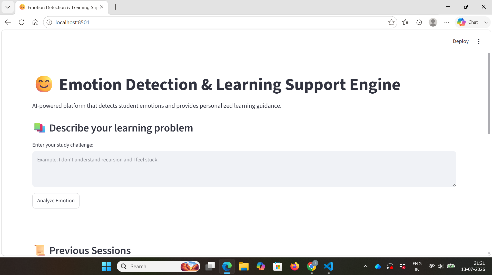
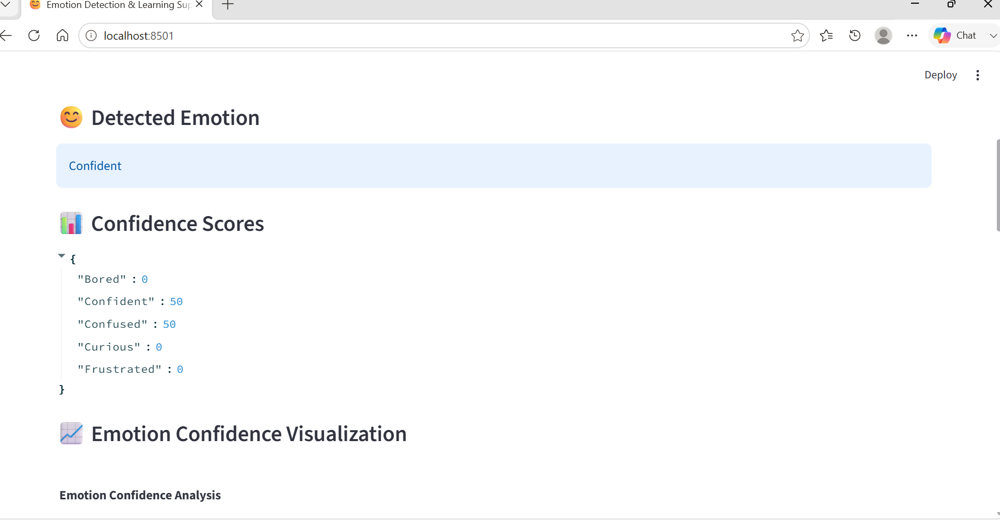
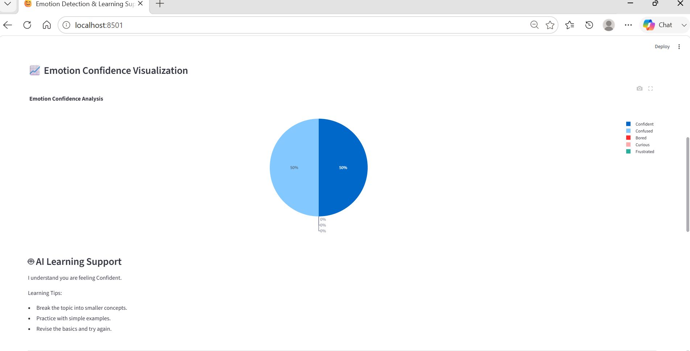
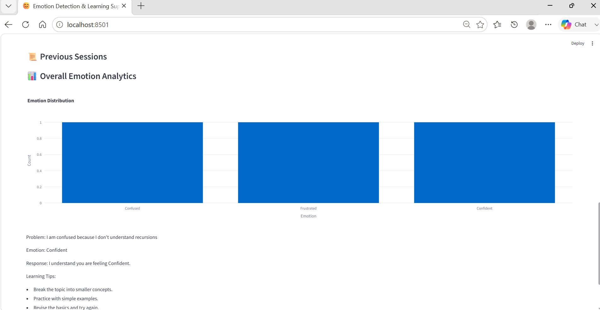

# Emotion Detection Learning Support Engine

## 📌 Project Overview

The **Emotion Detection Learning Support Engine** is an AI-powered educational assistant designed to understand students' emotional states during learning and provide personalized learning guidance.

Students often experience emotions such as confusion, frustration, lack of confidence, or motivation while learning difficult concepts. This system uses **Natural Language Processing (NLP), Machine Learning, and Generative AI** to analyze student input, detect emotions, and generate supportive learning suggestions.

The application provides an interactive interface where students can describe their learning problems and receive emotion-aware assistance.

---

# 🎯 Objectives

- Detect students' emotions from text-based learning problems.
- Provide personalized learning support using Generative AI.
- Understand students' learning difficulties.
- Improve student engagement and confidence.
- Maintain learning session records.
- Visualize emotion analysis results.

---

# ✨ Features

## 1. Emotion Detection

- Analyzes student text input.
- Identifies emotional states related to learning.
- Provides confidence scores for detected emotions.

## 2. AI Learning Support

- Uses Google Gemini Generative AI.
- Generates personalized explanations and learning strategies.
- Provides motivational guidance based on student emotions.

## 3. Interactive Web Interface

- Built using Streamlit.
- Simple and user-friendly design.
- Real-time emotion analysis.

## 4. Emotion Analytics Dashboard

- Displays confidence scores.
- Shows learning session insights.
- Helps analyze emotional patterns.

## 5. Secure API Management

- Gemini API key stored securely using `.env`.
- Sensitive information is protected using `.gitignore`.

---

# 🏗️ System Architecture

```
Student Input
      |
      ↓
Text Preprocessing
      |
      ↓
Emotion Detection Model
      |
      ↓
Emotion Analysis
      |
      ↓
Google Gemini AI
      |
      ↓
Personalized Learning Support
      |
      ↓
Dashboard & History
```

---

# 🛠️ Technologies Used

## Programming Language
- Python

## Frameworks & Libraries
- Streamlit
- TensorFlow / Keras
- Natural Language Processing
- Scikit-learn
- Pandas
- Plotly

## Generative AI
- Google Gemini API

## Development Tools
- VS Code
- Git
- GitHub

---

# 📂 Project Structure

```
Emotion-Detection-Learning-Support-Engine
│
├── app.py
├── src
│   ├── emotion_detector.py
│   ├── gemini_helper.py
│   ├── dashboard.py
│   └── utility files
│
├── data
├── models
├── assets
│   ├── 01_home_interface.png
│   ├── 02_emotion_detection_result.png
│   ├── 03_confidence_analysis.png
│   └── 04_session_history_dashboard.png
│
├── docs
│   ├── Requirement Analysis
│   ├── System Design
│   ├── Project Planning
│   ├── Testing Report
│   └── Demonstration
│
├── logs
├── README.md
└── requirements.txt
```

---

# ⚙️ Installation and Setup

Clone the repository:

```bash
git clone https://github.com/tanveerali06/Emotion-Detection-Learning-Support-Engine.git
```

Navigate to project folder:

```bash
cd Emotion-Detection-Learning-Support-Engine
```

Install dependencies:

```bash
pip install -r requirements.txt
```

Create a `.env` file:

```
GEMINI_API_KEY=your_api_key_here
```

Run the application:

```bash
streamlit run app.py
```

---

# Application Screenshots

## Home Interface



## Emotion Detection Result



## Confidence Analysis



## Session History Dashboard


---

# 🎥 Project Demonstration

Watch the complete demonstration of the **Emotion Detection Learning Support Engine** below.

## 🌐 Live Application

👉 **Launch the App:** https://emotion-detection-learning-support-engine-22ycqnfwuuwhlgka9sh8.streamlit.app

### ▶️ Demo Video

🔗 **Google Drive:**  
https://drive.google.com/file/d/1whSEAcSuh3qWtETURKjtS_2z0Z44KRfc/view?usp=drivesdk

The demonstration includes:
- Home Interface
- Emotion Detection
- AI Learning Support
- Confidence Analysis
- Session History Dashboard

# 🧪 Testing

The application was tested with different student learning inputs:

- Confusion while understanding programming concepts.
- Frustration after difficulty in learning.
- Confidence after completing tasks.

The system successfully detected emotions and generated learning support responses.

---

# 🚀 Future Enhancements

- Voice-based emotion detection.
- Real-time classroom emotion monitoring.
- Mobile application development.
- Advanced deep learning emotion models.
- Multilingual learning support.
- Integration with Learning Management Systems.

---
---

# 👨‍💼 Project Team

This project was successfully developed by the following team members as part of the academic mini project.

### 🏆 Team Lead

**Syed Tanveer Ali**  
📧 tnvrlsyed@gmail.com

---

### 👨‍💻 Team Members

**Yenugupalli Akshay**  
📧 y.akshay9618563877@gmail.com

**Lekha Sanjana Velagala**  
📧 velagala.lekhasanjana28@gmail.com

**Krishna Manohar Mahalakshmi Varma Sangani**  
📧 sanganikrishnamanohar@gmail.com

**Sivanandeeswa Tanala**  
📧 sivatanala@gmail.com

---

# 👨‍🎓 Developed By

**Syed Tanveer Ali**  
**Yenugupalli Akshay**  
**Lekha Sanjana Velagala**  
**Krishna Manohar Mahalakshmi Varma Sangani**  
**Sivanandeeswa Tanala**

**Emotion Detection Learning Support Engine**  
Department of Computer Science & Engineering  
Ideal Institute of Technology  
B.Tech Computer Science Engineering
---

# 📄 License

This project is developed for educational and research purposes.